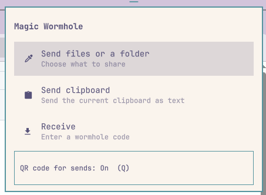
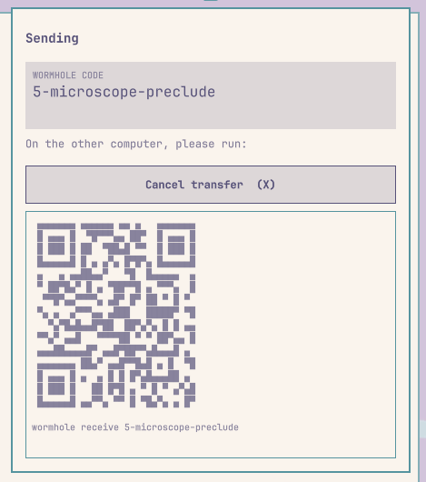
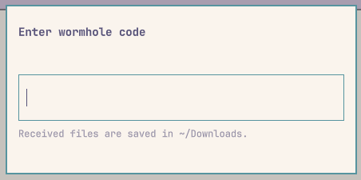
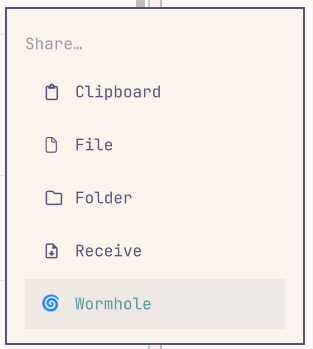

# Magic Wormhole for Omarchy

A native Omarchy bar dropdown for sending files, folders, and
clipboard text with [magic-wormhole](https://magic-wormhole.readthedocs.io/).



## Requirements

- Omarchy 4 (Quattro shell)
- `magic-wormhole`
- `wl-clipboard`

Install the command-line dependencies with:

```sh
omarchy pkg add magic-wormhole wl-clipboard
```

## Install

```sh
omarchy plugin add https://github.com/dcchambers/omarchy-wormhole.git --enable
```

The plugin is placed in the right section of the bar by default. Click its
button to open the dropdown. You can also summon it directly:

```sh
omarchy-shell shell toggle dcchambers.omarchy-wormhole '{}'
```

## Menu Entry

To add Wormhole under **Share** in the Omarchy menu, add this entry to
`~/.config/omarchy/extensions/omarchy-menu.jsonc`:

```jsonc
"trigger.share.wormhole": {
  "icon": "🌀",
  "label": "Wormhole",
  "action": "omarchy-shell shell toggle dcchambers.omarchy-wormhole '{}'",
  "when": "command -v wormhole",
  "description": "Send and receive files with magic-wormhole"
},
```

## Usage

- **Send files or a folder:** choose files or one folder. Multiple files are
  packaged as `wormhole-files.tar.gz` before transfer.
- **Send clipboard:** sends the current text clipboard.
- **Receive:** enter the sender's wormhole code. Files are saved in
  `~/Downloads`. If the destination already exists, the panel asks before
  replacing it.
- Click the displayed code, or press Enter, to copy a ready-to-run
  `wormhole receive <code>` command.
- Click **Cancel** or press `X` to interrupt an active send or receive.
- Escape hides the dropdown without interrupting an active transfer.

## Additional Screenshots

Send



Receive



Share Menu



## Remove

```sh
omarchy plugin remove dcchambers.omarchy-wormhole
```
